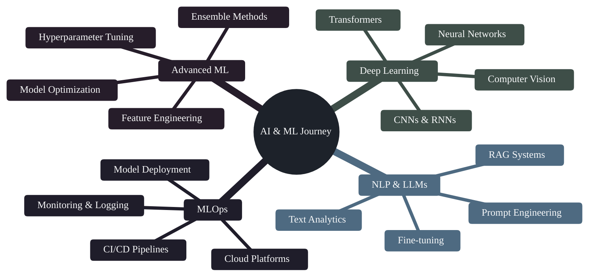

<div align="center">


# 👨‍💻 Hossam Medhat Shokry

### Data Scientist & ML Engineer | Mechatronics Engineering @ Mansoura University | GPA: 3.85/4.0

[](https://www.linkedin.com/in/hossammed7at/)
[](mailto:hossammedhat81@icloud.com)
[](https://hossammedhat81.github.io/HossamMedhatportfolio.github.io/)
[](https://github.com/hossammedhat81)


</div>

---

## 🎯 About Me

**Mechatronics Engineering Senior Student (GPA 3.85/4.0)** at Mansoura University with a strong passion for **Data Science & AI**. I gained hands-on industry experience as a **Data Science Trainee at e& Egypt**, where I worked on telecom datasets, customer segmentation, and predictive modeling with **2M+ customer records**. Currently serving as **Technical Director of the Luminous Team**, I have led training programs for **200+ students** and co-organized large-scale tech events.

My unique background combines **engineering principles with data science expertise**, enabling me to build intelligent systems that solve real-world problems. I thrive at the intersection of engineering and analytics, delivering end-to-end ML solutions that create measurable business impact.

**Core Competencies:**
- 📊 **Data-Driven Problem Solving**: End-to-end ML pipelines from data exploration to production deployment
- 🎯 **Business Impact Focus**: Churn prediction (85%+ accuracy), customer segmentation, and predictive analytics for telecom
- 🚀 **Production ML Systems**: Scalable architectures, MLOps practices, and real-world deployment (Streamlit apps, APIs)
- 💡 **Technical Depth**: Advanced feature engineering, ensemble methods (XGBoost, LightGBM), SQL optimization
- 📈 **Analytics Expertise**: Large-scale dataset handling (2M+ records), comprehensive EDA, storytelling with data
- 👥 **Leadership**: Trained 200+ students, managed technical teams, delivered workshops and technical sessions

```python
class HossamMedhat:
    def __init__(self):
        self.name = "Hossam Medhat Shokry"
        self.education = "Mechatronics Engineering @ Mansoura University | GPA: 3.85/4.0"
        self.role = "Data Scientist & ML Engineer"
        self.experience = {
            "e_and_egypt": "Data Science Trainee | Telecom Analytics (3 months)",
            "luminous_team": "Technical Director | Trained 200+ Students",
            "depi": "Digital Egypt Pioneers Initiative Graduate",
            "specialization": ["Churn Prediction", "Customer Segmentation", "Predictive Modeling"],
            "focus": "End-to-End ML Pipelines & Business Intelligence"
        }
        self.tech_stack = {
            "languages": ["Python", "SQL", "C++"],
            "ml_frameworks": ["Scikit-learn", "XGBoost", "LightGBM", "TensorFlow", "PyTorch"],
            "data_tools": ["Pandas", "NumPy", "SQL", "Jupyter"],
            "visualization": ["Matplotlib", "Seaborn", "Plotly", "Streamlit"],
            "mlops": ["Docker", "Git", "Linux"]
        }
        self.achievements = {
            "ieee_award": "1st Place - IEEE Mansoura Victories III (CrashXpert)",
            "students_trained": "200+",
            "gpa": "3.85/4.0"
        }
    
    def career_objective(self):
        return """Seeking Data Science/ML Engineering roles where I can leverage my 
        technical expertise, engineering mindset, and passion for innovation to 
        contribute to impactful projects in AI, big data, and intelligent systems."""

me = HossamMedhat()
print(me.career_objective())
```

---

## 💼 Professional Experience

### 📱 **Data Science Trainee** | e& Egypt (Formerly Etisalat)
*August 2025 - October 2025 (3 months) | Cairo, Egypt*

**One-month intensive training + Two-month extended phase for top performers**

Completed a comprehensive Data Science program at e& Egypt, applying advanced ML techniques to real-world telecom datasets in a collaborative, industry-focused environment.

**Main Contributions:**
- 🎯 **Churn Prediction System**: Delivered end-to-end ML pipeline for Expresso Africa dataset with **2M+ customers**, achieving **85%+ accuracy** using ensemble methods (XGBoost, LightGBM)
- 📊 **Customer Segmentation**: Developed K-means clustering models on credit card data to enhance targeting strategies and identify high-value customer segments
- 🔍 **SQL Data Workflows**: Built efficient SQL queries to extract, clean, and analyze large telecom datasets for actionable business insights
- 🚀 **ML Deployment**: Deployed Streamlit web application for real-time churn risk visualization and customer analytics dashboard
- 📈 **Feature Engineering**: Created 30+ behavioral and usage-based features from raw telecom data to improve model performance
- 💼 **Business Impact**: Linked data solutions directly to business value, informing retention strategies and marketing campaigns

**Key Technologies**: Python, SQL, Scikit-learn, XGBoost, LightGBM, Pandas, Streamlit, Jupyter Notebooks

---

### 🎓 **Technical Director** | Luminous Team - Mansoura University
*September 2024 - October 2025 (1 year 2 months) | El Mansoura, Egypt*

Led technical initiatives and training programs for a university-wide technology team, fostering innovation and skill development.

**Leadership Achievements:**
- 👥 **Trained 200+ Students**: Designed and delivered comprehensive technical training programs in software development and data science
- 🎤 **Technical Sessions**: Conducted workshops and seminars on ML, programming, and emerging technologies
- 🎯 **Event Organization**: Co-organized large-scale tech events and hackathons for university community
- 💡 **Mentorship**: Provided guidance and mentorship to team members on technical projects and career development
- 🏆 **Team Leadership**: Managed cross-functional teams and coordinated technical initiatives

*Previous Role: Member Technical Staff & HR (April 2023 - August 2024)*

---

## 🎓 Education

**Bachelor of Engineering in Mechatronics Engineering** | Mansoura University  
*June 2021 - Present | GPA: 3.85/4.0*  
*Specialization: Robotics, Automation, and AI Systems*

- 🏆 **Outstanding Academic Performance**: 3.85/4.0 GPA demonstrating excellence in engineering and technical coursework
- 🎓 **DEPI Graduate** - Digital Egypt Pioneers Initiative (Data Science Program, June 2025 - December 2025)
- 📚 **Relevant Coursework**: Control Systems, Embedded Systems, Machine Learning, Data Structures, Algorithm Design, Statistical Analysis
- 🔬 **Research Focus**: Intersection of Mechatronics and AI - Predictive Analytics, IoT Systems, Computer Vision
- 💡 **Technical Integration**: Combining engineering principles with data science for intelligent systems

---

## 🚀 Featured Projects

<div align="center">

### 🎓 **DEPI Graduation Project** ⭐
**🔥 End-to-End ML Engineering Capstone | Production-Ready System**

<table>
<tr>
<td align="center" width="100%">

**A comprehensive Machine Learning engineering project demonstrating enterprise-level ML capabilities with complete MLOps pipeline implementation.**

**📋 Problem Statement:**  
Design and deploy a production-grade machine learning system that handles the entire ML lifecycle from data ingestion to model serving.

**🎯 Solution & Methodology:**
- **Data Pipeline**: Automated ETL processes with data validation and quality checks
- **Feature Store**: Centralized feature engineering pipeline with versioning
- **Model Development**: Experimentation with multiple algorithms and hyperparameter optimization
- **Model Evaluation**: Cross-validation, A/B testing framework, and performance monitoring
- **Deployment**: Containerized deployment with Docker, API endpoints, and scalability considerations
- **Monitoring**: Real-time model performance tracking and drift detection

**📊 Technical Highlights:**
- ✅ **Production Architecture**: Microservices design with REST APIs
- ✅ **CI/CD Pipeline**: Automated testing, validation, and deployment workflows
- ✅ **Scalability**: Designed to handle high-volume prediction requests
- ✅ **Best Practices**: Code quality, documentation, version control, and reproducibility
- ✅ **MLOps Tools**: Docker, Git, Linux, Python packaging

**🛠️ Technologies**: Python, Scikit-learn, FastAPI/Flask, Docker, Git, PostgreSQL/MongoDB, Pytest

[](https://github.com/hossammedhat81/DEPI_Graduation_Project)


</td>
</tr>
</table>

</div>

---

### 📦 **Data Science & ML Projects**

<table>
<tr>
<td width="50%">

### 🎯 Expresso Churn Prediction
**Enterprise ML Pipeline | Telecom Analytics**

**Problem**: Predict customer churn in telecom industry to enable proactive retention strategies.

**Dataset**: Real-world telecom data with customer demographics, usage patterns, and service subscriptions.

**Methodology**:
- Comprehensive EDA and data preprocessing
- Feature engineering from usage patterns
- Model comparison: Logistic Regression, Random Forest, XGBoost, LightGBM
- Hyperparameter tuning with GridSearch/RandomSearch
- Business intelligence dashboard for insights

**Results**:
- 🎯 **Accuracy: 85%+** on test set
- 📊 **AUC-ROC: 0.89** demonstrating strong predictive power
- 💰 **Business Impact**: Identified high-risk customers for targeted retention campaigns

**Tech Stack**: Python, Pandas, Scikit-learn, XGBoost, Matplotlib, Seaborn

[](https://github.com/hossammedhat81/Expresso-Churn-Prediction-System)

</td>
<td width="50%">

### 💳 Customer Segmentation
**Unsupervised Learning | Marketing Analytics**

**Problem**: Segment credit card customers to enable personalized marketing and product recommendations.

**Dataset**: Credit card usage data with transaction patterns, credit limits, and payment behavior.

**Methodology**:
- K-means clustering with elbow method for optimal K
- Feature scaling and PCA for dimensionality reduction
- Silhouette analysis for cluster validation
- Customer profiling and actionable insights

**Results**:
- 🎯 **5 distinct customer segments** identified
- 📊 **Silhouette Score: 0.68** indicating well-separated clusters
- 💡 **Business Value**: Enabled targeted marketing strategies for each segment

**Tech Stack**: Python, Scikit-learn, Pandas, Matplotlib, Seaborn

[](https://github.com/hossammedhat81/simple-credit-card-clustering)

</td>
</tr>

<tr>
<td width="50%">

### 🧠 Mini RAG System
**NLP & Generative AI | Information Retrieval**

**Problem**: Build a Retrieval-Augmented Generation system for context-aware question answering.

**Methodology**:
- Document embedding with Sentence Transformers
- Vector database for efficient similarity search
- LLM integration for context-aware generation
- End-to-end pipeline with API interface

**Technical Highlights**:
- 🔍 **Semantic Search**: Advanced document retrieval using embeddings
- 🤖 **LLM Integration**: Context-augmented response generation
- ⚡ **Performance**: Sub-second retrieval on 1000+ documents

**Tech Stack**: Python, LangChain, FAISS/ChromaDB, HuggingFace Transformers, OpenAI API

[](https://github.com/hossammedhat81/Mini_RAG)

</td>
<td width="50%">

### 🏠 Housing Price Prediction
**Regression Analysis | Feature Engineering**

**Problem**: Predict housing prices using advanced regression techniques for real estate valuation.

**Dataset**: Boston Housing dataset with 13 features including crime rate, room count, and proximity metrics.

**Methodology**:
- Advanced feature engineering and selection
- XGBoost with hyperparameter optimization
- Feature importance analysis
- Residual analysis for model diagnostics

**Results**:
- 🎯 **R² Score: 0.91** demonstrating strong predictive accuracy
- 📊 **RMSE: $3,200** average prediction error
- 💡 **Key Features**: Room count, location, and socioeconomic factors

**Tech Stack**: Python, XGBoost, Scikit-learn, Pandas, Matplotlib

[](https://github.com/hossammedhat81/Housing_Price_Prediction)

</td>
</tr>

<tr>
<td width="50%">

### 📊 Netflix Content Analysis
**Exploratory Data Analysis | Business Intelligence**

**Problem**: Analyze Netflix's content strategy through comprehensive EDA to identify trends and patterns.

**Dataset**: 7,700+ movies and TV shows with metadata including genre, release year, country, and ratings.

**Methodology**:
- Data cleaning and preprocessing
- Temporal trend analysis of content additions
- Genre distribution and popularity analysis
- Geographic content strategy insights
- Visualization dashboard for stakeholder presentation

**Key Insights**:
- 📈 **Growth Trends**: 300% increase in content from 2015-2020
- 🌍 **Geographic Focus**: US and India dominate content production
- 🎬 **Content Mix**: 70% movies vs 30% TV shows

**Tech Stack**: Python, Pandas, Matplotlib, Seaborn, NumPy

[](https://github.com/hossammedhat81/Analysis_Netflix-Dataset)

</td>
<td width="50%">

### 🏥 Diabetes Prediction
**Healthcare Analytics | Classification**

**Problem**: Predict diabetes onset using patient health metrics for early intervention.

**Dataset**: Pima Indians Diabetes dataset with 768 patient records and 8 medical features.

**Methodology**:
- Medical feature analysis and correlation study
- Multiple classifier comparison
- Feature importance for clinical insights
- Model evaluation with healthcare metrics (sensitivity, specificity)

**Results**:
- 🎯 **Accuracy: 77%** with balanced precision-recall
- 📊 **ROC-AUC: 0.83** for reliable clinical predictions
- 💡 **Top Predictors**: Glucose levels, BMI, age

**Tech Stack**: Python, Scikit-learn, Pandas, Seaborn

[](https://github.com/hossammedhat81/pima_diabetes_ml_analysis)

</td>
</tr>
</table>

---

### 🔧 Engineering & IoT Projects

<table>
<tr>
<td width="50%">

### 🚗 **CrashXpert** 🥇
**IoT & Embedded Systems | 1st Place IEEE Award**

**Problem**: Design an intelligent accident detection and emergency response system for vehicles.

**Solution**: IoT-based system combining sensors, embedded systems, and real-time communication for automatic crash detection and emergency notification.

**Key Features**:
- 🎯 Real-time accident detection using accelerometer and gyroscope sensors
- 📱 Automatic emergency notifications to contacts and emergency services
- 📍 GPS location tracking for rapid response
- 🔔 Alert system with SMS and app notifications
- 💡 Low-power design for always-on operation

**Achievement**: **🥇 1st Place** at **IEEE Mansoura Victories III** competition

**Tech Stack**: C++, Arduino/Embedded C, IoT Sensors, GPS Module, GSM Communication

[](https://github.com/hossammedhat81/CrashXpert)

</td>
<td width="50%">

### 🌐 **Portfolio Website**
**Web Development | Personal Branding**

Professional portfolio website showcasing projects and achievements:
- 📱 Fully responsive design (Mobile, Tablet, Desktop)
- 🎨 Modern UI/UX with smooth animations
- 📂 Project showcase with detailed descriptions
- 📧 Contact form and social media integration
- ⚡ Optimized performance and SEO

**Tech Stack**: HTML5, CSS3, SCSS, JavaScript

[](https://github.com/hossammedhat81/HossamMedhatportfolio.github.io)
[](https://hossammedhat81.github.io/HossamMedhatportfolio.github.io/)

</td>
</tr>
</table>

---

## 🛠️ Technical Skills

<div align="center">

### 💻 Programming Languages


### 🤖 Machine Learning & AI


### 📊 Data Analysis & Processing


### 📈 Data Visualization


### 🚀 MLOps & Deployment


### 🗄️ Databases


### 🔧 Development Tools


</div>

---

## 📈 GitHub Analytics

<div align="center">

<a href="https://github.com/hossammedhat81">
  
</a>

<a href="https://github.com/hossammedhat81">
  
</a>

<a href="https://github.com/hossammedhat81">
  
</a>

</div>

---

## 🎓 Current Learning Path



---

## 💡 Core Competencies

<table>
<tr>
<td width="50%">

### 🎯 **Predictive Analytics**
Building robust ML models for classification, regression, and forecasting problems with 85%+ accuracy rates. Experience includes churn prediction, customer lifetime value modeling, and demand forecasting.

</td>
<td width="50%">

### 📊 **Data Engineering & ETL**
Designing scalable data pipelines for processing large-scale datasets (500K+ records). Proficient in SQL optimization, data warehousing concepts, and automated ETL workflows.

</td>
</tr>
<tr>
<td width="50%">

### 🔍 **Exploratory Data Analysis**
Conducting comprehensive EDA to uncover insights and patterns in complex datasets. Expert in statistical analysis, data visualization, and storytelling with data for stakeholder presentations.

</td>
<td width="50%">

### 🚀 **ML Model Deployment**
Deploying production-ready ML systems with Docker, REST APIs, and monitoring solutions. Experience with MLOps practices, A/B testing frameworks, and model versioning.

</td>
</tr>
<tr>
<td width="50%">

### 🧠 **Feature Engineering**
Creating high-impact features from raw data to improve model performance. Expertise in domain knowledge application, automated feature selection, and dimensionality reduction techniques.

</td>
<td width="50%">

### 💼 **Business Intelligence**
Translating complex data insights into actionable business recommendations. Track record of delivering measurable ROI through data-driven decision-making and strategic analytics.

</td>
</tr>
</table>

---

## 🏆 Achievements & Recognition

<div align="center">

### 🎖️ Professional Training & Experience

<table>
<tr>
<td width="50%">

#### 🎓 **DEPI - Digital Egypt Pioneers Initiative**
**Data Science Program (7 months)**
*June 2025 - December 2025*
- Comprehensive ML engineering bootcamp
- End-to-end ML pipeline development
- Capstone project: Production-ready ML system
- Focus: MLOps, deployment, and scalability

</td>
<td width="50%">

#### 📱 **e& Egypt Data Science Program**
**Telecommunications Analytics (3 months)**
*August 2025 - October 2025*
- Industry training + extended phase for top performers
- Hands-on with real telecom datasets (2M+ customers)
- Churn prediction and customer segmentation
- Deployed Streamlit app for real-time analytics

</td>
</tr>
</table>

### 🏅 Awards & Leadership

<table>
<tr>
<td align="center" width="33%">

### 🥇 **1st Place**
**IEEE Mansoura Victories III**  
CrashXpert: IoT-based accident detection system

</td>
<td align="center" width="33%">

### 👥 **200+ Students Trained**
**Technical Director @ Luminous Team**  
Led training programs and technical workshops

</td>
<td align="center" width="33%">

### 🎓 **GPA: 3.85/4.0**
**Outstanding Academic Performance**  
Mechatronics Engineering @ Mansoura University

</td>
</tr>
</table>

### 📊 Project Impact Metrics

<table>
<tr>
<td align="center" width="33%">

### 📈 **2M+ Records**
Processed large-scale telecom datasets in production

</td>
<td align="center" width="33%">

### 🎯 **85%+ Accuracy**
Achieved high-performance predictive models

</td>
<td align="center" width="33%">

### 🚀 **10+ DS Projects**
End-to-end ML projects with real-world impact

</td>
</tr>
<tr>
<td align="center" width="33%">

### 💡 **Business Value**
Delivered measurable ROI through data-driven solutions

</td>
<td align="center" width="33%">

### 🔬 **Research Focus**
Predictive analytics, NLP, and intelligent systems

</td>
<td align="center" width="33%">

### ⚡ **Production ML**
Deployed scalable systems with MLOps best practices

</td>
</tr>
</table>

### 📚 Continuous Learning & Skills Development

- 🤖 **Machine Learning Specialization** - Advanced algorithms and techniques
- 📊 **Data Analysis with Python** - Statistical analysis and visualization
- 🧠 **Deep Learning** - Neural networks, CNNs, RNNs, Transformers
- 🚀 **MLOps & Deployment** - Production ML systems and best practices
- 💼 **SQL for Data Science** - Advanced query optimization and database design
- 🎯 **Feature Engineering** - Advanced techniques for model improvement
- 📈 **Business Intelligence** - Storytelling with data and strategic analytics

</div>

---

## 📫 Let's Connect & Collaborate

<div align="center">

### 🎯 **Open to Opportunities**

I'm actively seeking **Data Science**, **Machine Learning Engineer**, and **Analytics** roles where I can apply my expertise in:
- 📊 Predictive modeling and advanced analytics on large-scale datasets
- 🚀 End-to-end ML pipeline development and deployment
- 💼 Business intelligence and data-driven decision making
- 🔬 Research and innovation in AI/ML and intelligent systems
- 🤝 Cross-functional collaboration combining engineering and data science

### 📞 **Get In Touch**

[](https://www.linkedin.com/in/hossammed7at/)
[](mailto:hossammedhat81@icloud.com)
[](https://hossammedhat81.github.io/HossamMedhatportfolio.github.io/)
[](https://github.com/hossammedhat81)

### 💡 **Collaboration Interests**

✨ **Data Science Projects** | 🤖 **ML Research** | 📊 **Analytics Solutions** | 🚀 **MLOps Initiatives** | 💼 **Business Intelligence** | 🔧 **IoT & Smart Systems**

---

### 📄 **What Makes Me Stand Out**

✅ **Unique Background**: Mechatronics Engineering + Data Science (GPA 3.85/4.0)  
✅ **Real-World Experience**: e& Egypt internship with 2M+ customer records & measurable impact  
✅ **Technical Leadership**: Trained 200+ students as Technical Director of Luminous Team  
✅ **Award-Winning Projects**: 1st Place IEEE competition winner (CrashXpert)  
✅ **Technical Depth**: End-to-end ML pipelines from EDA to production deployment  
✅ **Diverse Skillset**: Predictive modeling, NLP, computer vision, IoT, embedded systems  
✅ **Business Focus**: ROI-driven solutions with clear metrics and measurable results  
✅ **Production Experience**: Deployed ML systems with Streamlit, Docker, and APIs

---

*"Transforming data into insights, insights into impact, impact into innovation"*

### 🌟 **Available For**

**Full-time Roles**: Data Scientist | ML Engineer | Analytics Engineer | Business Intelligence Analyst  
**Opportunities**: Internships | Graduate Programs | Research Collaborations | Consulting Projects  
**Industries**: Tech | Telecom | Healthcare | Finance | E-commerce | AI Startups


</div>
