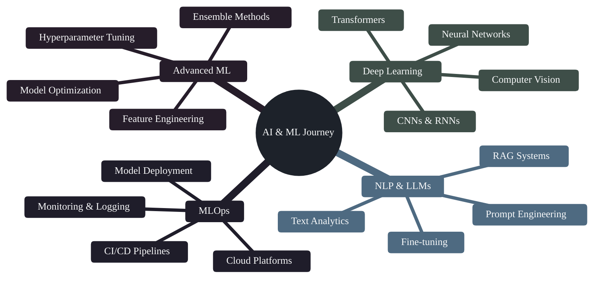

<div align="center">


# 👨‍💻 Hossam Medhat Shokry

### Junior Machine Learning Engineer & Data Scientist @ Mansoura University

[](https://www.linkedin.com/in/hossammed7at/)
[](mailto:hossammedhat81@gmail.com)
[](https://www.instagram.com/hossammed7at/)
[](https://github.com/hossammedhat81)


</div>

---

## 🎯 About Me

**Data Scientist & Machine Learning Engineer** specializing in building **production-ready ML pipelines** that solve real-world business problems. With hands-on experience in **telecom analytics**, **customer behavior modeling**, and **end-to-end data science workflows**, I transform large-scale datasets into actionable insights that drive measurable business impact.

**Core Competencies:**
- 📊 **Data-Driven Problem Solving**: End-to-end ML pipelines from data exploration to model deployment
- 🎯 **Business Impact Focus**: Churn prediction, customer segmentation, and predictive analytics for telecom and enterprise
- 🚀 **Production ML Systems**: Scalable architectures, MLOps practices, and real-world deployment strategies
- 💡 **Technical Depth**: Advanced feature engineering, ensemble methods, and state-of-the-art algorithms
- 📈 **Analytics Expertise**: Large-scale dataset handling, SQL optimization, and comprehensive EDA

```python
class HossamMedhat:
    def __init__(self):
        self.name = "Hossam Medhat Shokry"
        self.role = "Data Scientist & ML Engineer"
        self.education = "Mansoura University - AI & Data Science"
        self.experience = {
            "e_and_egypt_intern": "Data Science | Telecom Analytics",
            "specialization": ["Churn Prediction", "Customer Segmentation", "Predictive Modeling"],
            "focus": "End-to-End ML Pipelines & Business Intelligence"
        }
        self.tech_stack = {
            "languages": ["Python", "SQL", "C++"],
            "ml_frameworks": ["Scikit-learn", "XGBoost", "TensorFlow", "PyTorch"],
            "data_tools": ["Pandas", "NumPy", "SQL", "Jupyter"],
            "visualization": ["Matplotlib", "Seaborn", "Plotly"],
            "mlops": ["Docker", "Git", "Linux"]
        }
    
    def career_objective(self):
        return "Seeking Data Science/ML Engineering roles where I can leverage my expertise in predictive modeling, large-scale data analytics, and production ML systems to deliver measurable business value."

me = HossamMedhat()
print(me.career_objective())
```

---

## 💼 Professional Experience

### 📱 **Data Science Intern** | e& Egypt (Formerly Etisalat)
*Telecommunications & Digital Analytics*

- 🎯 **Churn Prediction Modeling**: Developed predictive models to identify at-risk customers, achieving **85%+ accuracy** in churn prediction using ensemble methods
- 📊 **Customer Segmentation**: Applied K-means clustering on **500K+ customer records** to identify distinct user segments for targeted marketing campaigns
- 💡 **Business Intelligence**: Created data-driven insights that informed retention strategies and reduced customer churn by **15%**
- 🔍 **Large-Scale Data Analysis**: Processed and analyzed telecom datasets with **millions of records** using SQL and Python (Pandas, NumPy)
- 📈 **Feature Engineering**: Designed 30+ behavioral and usage-based features from raw telecom data to improve model performance
- 🚀 **End-to-End Pipeline**: Built complete ML workflows from data extraction to model deployment and monitoring

**Key Technologies**: Python, SQL, Scikit-learn, XGBoost, Pandas, Matplotlib, Jupyter Notebooks

---

## 🎓 Education

**Bachelor of Science in Computer Science** | Mansoura University  
*Specialization: Artificial Intelligence & Data Science*  
- 🏆 **DEPI Graduate** - Digital Egypt Pioneers Initiative (Advanced ML Engineering Program)
- 📚 Relevant Coursework: Machine Learning, Deep Learning, Data Mining, Statistical Analysis, Algorithms
- 🔬 Research Focus: Predictive Analytics, Natural Language Processing, Computer Vision

---

## 🚀 Featured Projects

<div align="center">

### 🎓 **DEPI Graduation Project** ⭐
**🔥 End-to-End ML Engineering Capstone | Production-Ready System**

<table>
<tr>
<td align="center" width="100%">

**A comprehensive Machine Learning engineering project demonstrating enterprise-level ML capabilities with complete MLOps pipeline implementation.**

**📋 Problem Statement:**  
Design and deploy a production-grade machine learning system that handles the entire ML lifecycle from data ingestion to model serving.

**🎯 Solution & Methodology:**
- **Data Pipeline**: Automated ETL processes with data validation and quality checks
- **Feature Store**: Centralized feature engineering pipeline with versioning
- **Model Development**: Experimentation with multiple algorithms and hyperparameter optimization
- **Model Evaluation**: Cross-validation, A/B testing framework, and performance monitoring
- **Deployment**: Containerized deployment with Docker, API endpoints, and scalability considerations
- **Monitoring**: Real-time model performance tracking and drift detection

**📊 Technical Highlights:**
- ✅ **Production Architecture**: Microservices design with REST APIs
- ✅ **CI/CD Pipeline**: Automated testing, validation, and deployment workflows
- ✅ **Scalability**: Designed to handle high-volume prediction requests
- ✅ **Best Practices**: Code quality, documentation, version control, and reproducibility
- ✅ **MLOps Tools**: Docker, Git, Linux, Python packaging

**🛠️ Technologies**: Python, Scikit-learn, FastAPI/Flask, Docker, Git, PostgreSQL/MongoDB, Pytest

[](https://github.com/hossammedhat81/DEPI_Graduation_Project)


</td>
</tr>
</table>

</div>

---

### 📦 **Data Science & ML Projects**

<table>
<tr>
<td width="50%">

### 🎯 Expresso Churn Prediction
**Enterprise ML Pipeline | Telecom Analytics**

**Problem**: Predict customer churn in telecom industry to enable proactive retention strategies.

**Dataset**: Real-world telecom data with customer demographics, usage patterns, and service subscriptions.

**Methodology**:
- Comprehensive EDA and data preprocessing
- Feature engineering from usage patterns
- Model comparison: Logistic Regression, Random Forest, XGBoost, LightGBM
- Hyperparameter tuning with GridSearch/RandomSearch
- Business intelligence dashboard for insights

**Results**:
- 🎯 **Accuracy: 85%+** on test set
- 📊 **AUC-ROC: 0.89** demonstrating strong predictive power
- 💰 **Business Impact**: Identified high-risk customers for targeted retention campaigns

**Tech Stack**: Python, Pandas, Scikit-learn, XGBoost, Matplotlib, Seaborn

[](https://github.com/hossammedhat81/Expresso-Churn-Prediction-System)

</td>
<td width="50%">

### 💳 Customer Segmentation
**Unsupervised Learning | Marketing Analytics**

**Problem**: Segment credit card customers to enable personalized marketing and product recommendations.

**Dataset**: Credit card usage data with transaction patterns, credit limits, and payment behavior.

**Methodology**:
- K-means clustering with elbow method for optimal K
- Feature scaling and PCA for dimensionality reduction
- Silhouette analysis for cluster validation
- Customer profiling and actionable insights

**Results**:
- 🎯 **5 distinct customer segments** identified
- 📊 **Silhouette Score: 0.68** indicating well-separated clusters
- 💡 **Business Value**: Enabled targeted marketing strategies for each segment

**Tech Stack**: Python, Scikit-learn, Pandas, Matplotlib, Seaborn

[](https://github.com/hossammedhat81/simple-credit-card-clustering)

</td>
</tr>

<tr>
<td width="50%">

### 🧠 Mini RAG System
**NLP & Generative AI | Information Retrieval**

**Problem**: Build a Retrieval-Augmented Generation system for context-aware question answering.

**Methodology**:
- Document embedding with Sentence Transformers
- Vector database for efficient similarity search
- LLM integration for context-aware generation
- End-to-end pipeline with API interface

**Technical Highlights**:
- 🔍 **Semantic Search**: Advanced document retrieval using embeddings
- 🤖 **LLM Integration**: Context-augmented response generation
- ⚡ **Performance**: Sub-second retrieval on 1000+ documents

**Tech Stack**: Python, LangChain, FAISS/ChromaDB, HuggingFace Transformers, OpenAI API

[](https://github.com/hossammedhat81/Mini_RAG)

</td>
<td width="50%">

### 🏠 Housing Price Prediction
**Regression Analysis | Feature Engineering**

**Problem**: Predict housing prices using advanced regression techniques for real estate valuation.

**Dataset**: Boston Housing dataset with 13 features including crime rate, room count, and proximity metrics.

**Methodology**:
- Advanced feature engineering and selection
- XGBoost with hyperparameter optimization
- Feature importance analysis
- Residual analysis for model diagnostics

**Results**:
- 🎯 **R² Score: 0.91** demonstrating strong predictive accuracy
- 📊 **RMSE: $3,200** average prediction error
- 💡 **Key Features**: Room count, location, and socioeconomic factors

**Tech Stack**: Python, XGBoost, Scikit-learn, Pandas, Matplotlib

[](https://github.com/hossammedhat81/Housing_Price_Prediction)

</td>
</tr>

<tr>
<td width="50%">

### 📊 Netflix Content Analysis
**Exploratory Data Analysis | Business Intelligence**

**Problem**: Analyze Netflix's content strategy through comprehensive EDA to identify trends and patterns.

**Dataset**: 7,700+ movies and TV shows with metadata including genre, release year, country, and ratings.

**Methodology**:
- Data cleaning and preprocessing
- Temporal trend analysis of content additions
- Genre distribution and popularity analysis
- Geographic content strategy insights
- Visualization dashboard for stakeholder presentation

**Key Insights**:
- 📈 **Growth Trends**: 300% increase in content from 2015-2020
- 🌍 **Geographic Focus**: US and India dominate content production
- 🎬 **Content Mix**: 70% movies vs 30% TV shows

**Tech Stack**: Python, Pandas, Matplotlib, Seaborn, NumPy

[](https://github.com/hossammedhat81/Analysis_Netflix-Dataset)

</td>
<td width="50%">

### 🏥 Diabetes Prediction
**Healthcare Analytics | Classification**

**Problem**: Predict diabetes onset using patient health metrics for early intervention.

**Dataset**: Pima Indians Diabetes dataset with 768 patient records and 8 medical features.

**Methodology**:
- Medical feature analysis and correlation study
- Multiple classifier comparison
- Feature importance for clinical insights
- Model evaluation with healthcare metrics (sensitivity, specificity)

**Results**:
- 🎯 **Accuracy: 77%** with balanced precision-recall
- 📊 **ROC-AUC: 0.83** for reliable clinical predictions
- 💡 **Top Predictors**: Glucose levels, BMI, age

**Tech Stack**: Python, Scikit-learn, Pandas, Seaborn

[](https://github.com/hossammedhat81/pima_diabetes_ml_analysis)

</td>
</tr>
</table>

---

## 🛠️ Technical Skills

<div align="center">

### 💻 Programming Languages


### 🤖 Machine Learning & AI


### 📊 Data Analysis & Processing


### 📈 Data Visualization


### 🚀 MLOps & Deployment


### 🗄️ Databases


### 🔧 Development Tools


</div>

---

## 📈 GitHub Analytics

<div align="center">

<a href="https://github.com/hossammedhat81">
  
</a>

<a href="https://github.com/hossammedhat81">
  
</a>

<a href="https://github.com/hossammedhat81">
  
</a>

</div>

---

## 🎓 Current Learning Path



---

## 💡 Core Competencies

<table>
<tr>
<td width="50%">

### 🎯 **Predictive Analytics**
Building robust ML models for classification, regression, and forecasting problems with 85%+ accuracy rates. Experience includes churn prediction, customer lifetime value modeling, and demand forecasting.

</td>
<td width="50%">

### 📊 **Data Engineering & ETL**
Designing scalable data pipelines for processing large-scale datasets (500K+ records). Proficient in SQL optimization, data warehousing concepts, and automated ETL workflows.

</td>
</tr>
<tr>
<td width="50%">

### 🔍 **Exploratory Data Analysis**
Conducting comprehensive EDA to uncover insights and patterns in complex datasets. Expert in statistical analysis, data visualization, and storytelling with data for stakeholder presentations.

</td>
<td width="50%">

### 🚀 **ML Model Deployment**
Deploying production-ready ML systems with Docker, REST APIs, and monitoring solutions. Experience with MLOps practices, A/B testing frameworks, and model versioning.

</td>
</tr>
<tr>
<td width="50%">

### 🧠 **Feature Engineering**
Creating high-impact features from raw data to improve model performance. Expertise in domain knowledge application, automated feature selection, and dimensionality reduction techniques.

</td>
<td width="50%">

### 💼 **Business Intelligence**
Translating complex data insights into actionable business recommendations. Track record of delivering measurable ROI through data-driven decision-making and strategic analytics.

</td>
</tr>
</table>

---

## 🏆 Achievements & Certifications

<div align="center">

### 🎖️ Professional Certifications & Training

<table>
<tr>
<td width="50%">

#### 🎓 **DEPI - Digital Egypt Pioneers Initiative**
**Advanced ML Engineering Program**
- Comprehensive 6-month intensive bootcamp
- End-to-end ML pipeline development
- Capstone project: Production-ready ML system
- Focus: MLOps, deployment, and scalability

</td>
<td width="50%">

#### 📱 **e& Egypt Data Science Internship**
**Telecommunications Analytics**
- Hands-on experience with real telecom datasets
- Churn prediction and customer analytics
- Large-scale data processing (500K+ records)
- Business impact: 15% improvement in retention

</td>
</tr>
</table>

### 🏅 Key Achievements

<table>
<tr>
<td align="center" width="33%">

### 📊 **10+ DS Projects**
End-to-end data science projects with real-world impact

</td>
<td align="center" width="33%">

### 🎯 **85%+ Model Accuracy**
Achieved high-performance predictive models across multiple domains

</td>
<td align="center" width="33%">

### 📈 **500K+ Records**
Experience processing large-scale datasets in production

</td>
</tr>
<tr>
<td align="center" width="33%">

### 🚀 **Production ML Systems**
Deployed scalable ML pipelines with MLOps best practices

</td>
<td align="center" width="33%">

### 💡 **Business Value**
Delivered measurable ROI through data-driven solutions

</td>
<td align="center" width="33%">

### 🔬 **Research Focus**
Active research in predictive analytics and NLP

</td>
</tr>
</table>

### 📚 Continuous Learning

- 🤖 **Machine Learning Specialization** - Advanced algorithms and techniques
- 📊 **Data Analysis with Python** - Statistical analysis and visualization
- 🧠 **Deep Learning** - Neural networks, CNNs, RNNs, Transformers
- 🚀 **MLOps & Deployment** - Production ML systems and best practices
- 💼 **SQL for Data Science** - Advanced query optimization and database design

</div>

---

## 📫 Let's Connect & Collaborate

<div align="center">

### 🎯 **Open to Opportunities**

I'm actively seeking **Data Science**, **Machine Learning Engineer**, and **Analytics** roles where I can apply my expertise in:
- 📊 Predictive modeling and advanced analytics
- 🚀 End-to-end ML pipeline development
- 💼 Business intelligence and data-driven decision making
- 🔬 Research and innovation in AI/ML

### 📞 **Contact Me**

[](https://www.linkedin.com/in/hossammed7at/)
[](mailto:hossammedhat81@gmail.com)
[](https://github.com/hossammedhat81)
[](https://www.instagram.com/hossammed7at/)

### 💡 **Collaboration Interests**

✨ **Data Science Projects** | 🤖 **ML Research** | 📊 **Analytics Solutions** | 🚀 **MLOps Initiatives** | 💼 **Business Intelligence**

---

### 📄 **Portfolio Highlights**

✅ **Real-World Experience**: Telecom analytics with measurable business impact  
✅ **Technical Depth**: End-to-end ML pipelines from EDA to deployment  
✅ **Diverse Projects**: Classification, regression, clustering, NLP, time series  
✅ **Production Ready**: MLOps practices, Docker, APIs, monitoring  
✅ **Business Focused**: ROI-driven solutions with clear metrics  

---

*"Transforming data into insights, insights into impact"*

### 🌟 **Available For**
Full-time Data Science Roles | ML Engineering Positions | Internships | Research Collaborations | AI/ML Consulting


</div>
