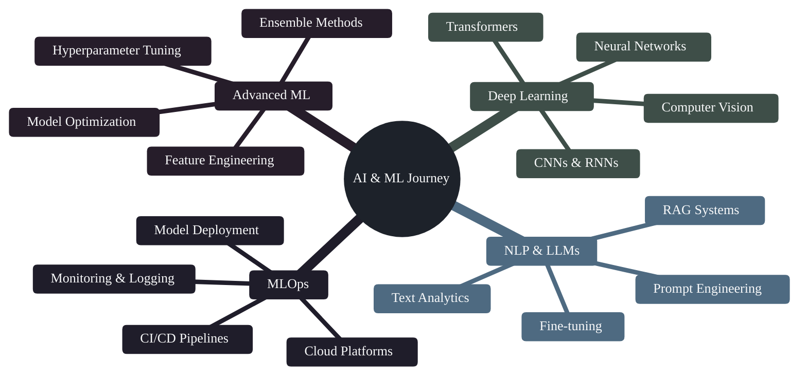

<div align="center">


# 👨‍💻 Hossam Medhat Shokry

### Junior Machine Learning Engineer & Data Scientist @ Mansoura University

[](https://www.linkedin.com/in/hossammed7at/)
[](mailto:hossammedhat81@gmail.com)
[](https://www.instagram.com/hossammed7at/)
[](https://github.com/hossammedhat81)


</div>

---

## 🎯 About Me

**Junior Machine Learning Engineer** and **Data Scientist** at **Mansoura University** with a passion for building intelligent systems and extracting actionable insights from data. I specialize in developing end-to-end machine learning solutions, predictive analytics, and AI-driven applications.

```python
class HossamMedhat:
    def __init__(self):
        self.name = "Hossam Medhat Shokry"
        self.role = "Junior ML Engineer & Data Scientist"
        self.education = "Mansoura University"
        self.languages = ["Python", "C++", "SQL", "JavaScript"]
        self.specialization = ["Machine Learning", "Deep Learning", "Data Analysis", "AI Systems"]
        self.focus_areas = ["Predictive Modeling", "NLP", "Computer Vision", "MLOps"]
        self.current_work = "End-to-End ML Projects & Advanced Analytics"
    
    def say_hi(self):
        print("Thanks for visiting! Let's transform data into insights together.")

me = HossamMedhat()
me.say_hi()
```

---

## 🚀 Featured Projects

<div align="center">

### 🎓 **DEPI Graduation Project** ⭐
**🔥 Capstone ML Engineering Project | End-to-End Solution**

<table>
<tr>
<td align="center" width="100%">

**A comprehensive Machine Learning project demonstrating full-stack ML engineering capabilities including data pipeline, model development, deployment, and production-ready implementation.**

**Key Highlights:**
- 🎯 **Complete ML Lifecycle**: From data preprocessing to model deployment
- 🧠 **Advanced Algorithms**: State-of-the-art machine learning techniques
- 📊 **Data Engineering**: Robust ETL pipelines and feature engineering
- 🚀 **Production Ready**: Scalable architecture and best practices
- 📈 **Performance Metrics**: Comprehensive evaluation and monitoring

[](https://github.com/hossammedhat81/DEPI_Graduation_Project)


</td>
</tr>
</table>

</div>

---

### 📦 **More Projects**

<table>
<tr>
<td width="50%">

### 🎯 Expresso Churn Prediction
**Enterprise ML Pipeline**

Comprehensive customer churn prediction system featuring:
- Multiple ML algorithms comparison
- Business intelligence analytics
- Real-world deployment strategies

[](https://github.com/hossammedhat81/Expresso-Churn-Prediction-System)

</td>
<td width="50%">

### 🧠 Mini RAG System
**AI & NLP**

End-to-end Retrieval-Augmented Generation:
- Advanced document retrieval
- Context-aware responses
- Modern AI architecture

[](https://github.com/hossammedhat81/Mini_RAG)

</td>
</tr>

<tr>
<td width="50%">

### 💳 Customer Segmentation
**Clustering & Analytics**

K-means clustering for actionable insights:
- Customer behavior analysis
- Targeted marketing strategies
- Business intelligence

[](https://github.com/hossammedhat81/simple-credit-card-clustering)

</td>
<td width="50%">

### 🏠 Housing Price Prediction
**Advanced ML**

XGBoost implementation with:
- Comprehensive feature engineering
- Advanced regression techniques
- Model optimization

[](https://github.com/hossammedhat81/Housing_Price_Prediction)

</td>
</tr>

<tr>
<td width="50%">

### 📊 Netflix Data Analysis
**Exploratory Data Analysis**

Deep dive into 7,700+ titles:
- Content trend analysis
- Distribution patterns
- Strategic insights

[](https://github.com/hossammedhat81/Analysis_Netflix-Dataset)

</td>
<td width="50%">

### 🏥 Diabetes Prediction
**Healthcare ML**

Predictive modeling for diabetes:
- Healthcare analytics
- Feature importance analysis
- Clinical insights

[](https://github.com/hossammedhat81/pima_diabetes_ml_analysis)

</td>
</tr>

<tr>
<td width="50%">

### 🌐 Portfolio Website
**Web Development**

Personal portfolio showcasing projects:
- Responsive design (HTML, CSS, SCSS, JavaScript)
- Modern UI/UX
- Project showcase

[](https://github.com/hossammedhat81/HossamMedhatportfolio.github.io)

</td>
<td width="50%">

### 🚗 CrashXpert
**C++ Development**

Advanced C++ application:
- Object-oriented programming
- Performance optimization
- Real-world problem solving

[](https://github.com/hossammedhat81/CrashXpert)

</td>
</tr>
</table>

---

## 🛠️ Tech Stack

<div align="center">

### Languages & Frameworks


### Data Science & ML


### Tools & Platforms


</div>

---

## 📈 GitHub Analytics

<div align="center">

<a href="https://github.com/hossammedhat81">
  
</a>

<a href="https://github.com/hossammedhat81">
  
</a>

<a href="https://github.com/hossammedhat81">
  
</a>

</div>

---

## 🎓 Current Learning Path



---

## 💼 What I Do

- 🤖 **Machine Learning Engineering** - Building and deploying predictive models and intelligent systems
- 📊 **Data Analysis & Visualization** - Extracting actionable insights from complex datasets
- 🧠 **Deep Learning** - Implementing neural networks for computer vision and NLP tasks
- 🚀 **MLOps & Deployment** - Creating production-ready ML pipelines and systems
- 📈 **Business Intelligence** - Transforming data into strategic business decisions
- 🔬 **Research & Innovation** - Exploring cutting-edge AI/ML techniques and applications

---

## 🏆 Achievements & Stats

- 📚 **10+ ML/Data Science Projects** - From concept to deployment
- 🎓 **Specialized in AI & Data Science** - Mansoura University
- 💻 **End-to-End ML Pipelines** - Production-ready implementations
- 🔬 **Research Focus** - Machine Learning, NLP, and Predictive Analytics
- 📊 **Data-Driven Solutions** - Real-world business impact
- 🎖️ **DEPI Graduate** - Advanced ML Engineering Program

---

## 📫 Let's Connect

<div align="center">

[](https://www.linkedin.com/in/hossammed7at/)
[](mailto:hossammedhat81@gmail.com)
[](https://www.instagram.com/hossammed7at/)

### 💡 Open to Collaborations!
**Machine Learning Projects | Data Science Research | AI Solutions | MLOps Initiatives**

---

*"Success is not final, failure is not fatal: it's the courage to continue that counts"*


</div>
